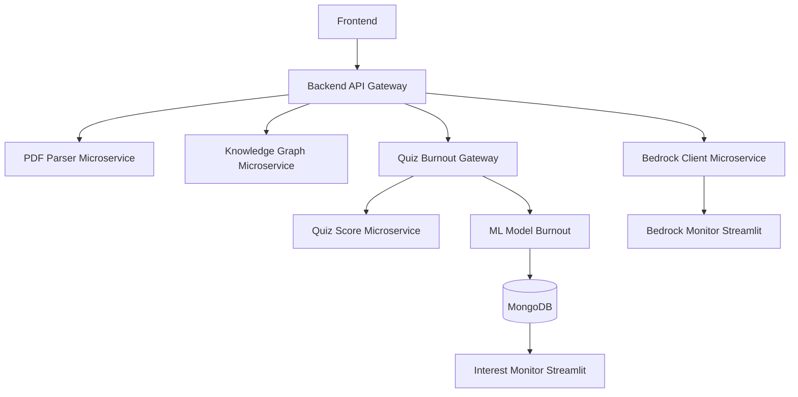

#  MindBoost

**MindBoost** is an intelligent academic companion platform built with a **microservices architecture**.  
It helps students and educators analyze study materials, generate knowledge graphs, create quizzes, track learning progress, and monitor academic well-being.

The system integrates **AI-powered document parsing, knowledge extraction, quiz generation, burnout prediction, and interest tracking**, all accessible via a modern React frontend orchestrated with **Docker Compose**.

---

##  Table of Contents

- [Overview](#overview)
- [Architecture](#architecture)
- [Microservices Included](#microservices-included)
- [Technologies Used](#technologies-used)
- [ML Model: Burnout Predictor](#ml-model-burnout-predictor)
- [Running the System](#running-the-system)
- [Running Microservices Individually](#running-microservices-individually)
- [Test Users](#test-users)
- [Initial Setup](#initial-setup)
- [Versioning & Contribution](#versioning--contribution)

---

##  Overview

MindBoost combines **data processing**, **AI inference**, and **interactive dashboards** to assist academic users in managing knowledge and maintaining a healthy balance between learning and well-being.

Core functionalities include:
- Parsing and analyzing uploaded study materials.
- Generating **knowledge graphs** to visualize concepts.
- Creating and scoring **AI-generated quizzes**.
- Monitoring **user interest** and **burnout risk** through machine learning.
- Providing real-time analytics via Streamlit dashboards.

---

## Architecture

All services are containerized and orchestrated via **Docker Compose**.  
Below is a simplified system diagram illustrating the service interactions:



---

##  Microservices Included

| Service | Technology | Description | Port |
|----------|-------------|--------------|------|
| **backend** | FastAPI | Main API Gateway, routes all requests | 8000 |
| **pdf-parser-microservice** | FastAPI | Parses PDF files and extracts text | 8001 |
| **bedrock-client-microservice** | FastAPI + Boto3 | Connects to AWS Bedrock for LLM tasks | 8002 |
| **knowledge-graph-microservice** | FastAPI + NetworkX | Generates knowledge graphs from parsed text | 8003 |
| **ml-model-burnout** | Flask | Predicts burnout probability using ML model | 8004 |
| **quiz-score-microservice** | Flask | Computes quiz results and stores them in MongoDB | 8010 |
| **quiz-burnout-gateway** | Flask | Aggregates quiz data and calls burnout model | 8011 |
| **interest-monitor-microservice** | Flask + Streamlit | Displays user topic interests and analytics | 8502 |
| **mongodb** | MongoDB | Stores quiz results, user data, and interests | 27017 |
| **bedrock-monitor** | Streamlit | Dashboard for Bedrock Client metrics | 8501 |
| **frontend** | React + MUI | Web interface for interacting with MindBoost | 3000 |

---

##  ML Model: Burnout Predictor

The **`ml-model-burnout`** microservice predicts a user’s likelihood of academic burnout using a trained model.

### **Model Details**
- Model: `model.pkl` (pre-trained using joblib)
- Input: Time series of scores (e.g., stress, wellbeing)
- Output: Probability of being close to burnout (0–1)

### **Input Example**
```json
{
  "user_id": "u1",
  "series": [
    {"date": "2025-01-05", "score": 82},
    {"date": "2025-01-12", "score": 78},
    {"date": "2025-01-20", "score": 74}
  ]
}
```

### **Output Example**
```json
{
  "user_id": "u1",
  "prob_close_to_burnout": 0.78,
  "features": { ... }
}
```

---

##  Running the System

You can run the entire MindBoost platform using Docker Compose.

```bash
# Build and start all services
docker-compose up --build
```

After all services start:
- **Frontend:** [http://localhost:3000](http://localhost:3000)
- **Bedrock Monitor:** [http://localhost:8501](http://localhost:8501)
- **Interest Monitor:** [http://localhost:8502](http://localhost:8502)
- **API Gateway:** Accessible at `http://localhost:8000`

---

##  Running Microservices Individually

Each service can be started separately for local development:

| Service | Directory | Command |
|----------|------------|----------|
| **Backend (Gateway)** | `src/backend` | `uvicorn src.main:app --reload` |
| **PDF Parser** | `src/pdf-parser-microservice` | `uvicorn src.main:app --reload` |
| **Bedrock Client** | `src/bedrock-client-microservice` | `uvicorn src.main:app --reload` |
| **Knowledge Graph** | `src/knowledge-graph-microservice` | `uvicorn src.main:app --reload` |
| **ML Model Burnout** | `src/ml_model_burnout` | `flask --app predict_service run --host=0.0.0.0 --port=8004` |
| **Quiz Score** | `quiz-score-microservice` | `flask --app main run --host=0.0.0.0 --port=8010` |
| **Quiz Burnout Gateway** | `quiz-burnout-gateway` | `flask --app main run --host=0.0.0.0 --port=8011` |
| **Bedrock Monitor** | `bedrock-monitor` | `streamlit run app.py` |
| **Interest Monitor** | `interest-monitor-microservice` | `streamlit run app.py` |

---

##  Test Users

Use these credentials during development and testing:

| Email | Password |
|--------|-----------|
| test1@example.com | password123 |
| test2@example.com | letmein456 |
| test3@example.com | qwerty789 |

---

##  Initial Setup

Before logging in for the first time, populate the local SQLite and MongoDB databases.

```bash
# Install dependencies
pip install -r misc/requirements.txt

# Run the database initialization script
python misc/init_db.py
```

---

##  Versioning and Contribution

### **Versioning**
- **Python:** 3.9 / 3.10  
- **Node:** 18+  
- Dependencies managed via `requirements.txt` and `package.json`.

### **Contributing**
Pull requests are welcome!  
Please open an issue to discuss proposed changes before submitting.

---

##  Summary

MindBoost provides:
- Modular **AI-powered learning analysis**
- Seamless **REST-based microservice communication**
- Real-time dashboards for **insightful monitoring**
- A robust and scalable **Dockerized environment**

---
